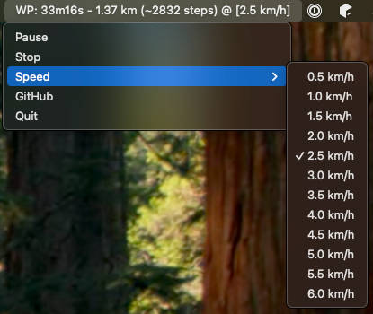

# WalkingPad Desktop Controller

A desktop application to control your WalkingPad treadmill from your computer.
Tested on macOS M1 with WalkingPad P1. Should work with similar models and other OS.
Thanks to [ph4r05](https://github.com/ph4r05/ph4-walkingpad) for the reverse-engineering work!



## Features

- Start/stop the WalkingPad belt
- Adjust speed from 0.5 to 6.0 km/h in 0.5 increments
- View real-time stats:
    - Current speed
    - Total walking time
    - Distance walked
    - Step count
- Automatic reconnection if Bluetooth connection is lost
- Pause to stop the belt without resetting statistics

## Installation

For macOS, either install the go binary, or build a DMG file locally using `./build-dmg.sh`.

## Configuration

The app optionally loads a configuration file from the following locations, while respecting `XDG_CONFIG_HOME`:

- macOS: `~/Library/Application Support/walkingpad.json`
- Windows: `%AppData%\walkingpad.json`
- Linux: `~/.config/walkingpad.json`

If present, the configuration file should be a JSON object with the following:

```json
{
  "preferredDevice": "1384b4f9-444e-9cfb-a0f2-c47819ad0183",
  "targetSpeed": 2.5
}
```

If the `preferredDevice` address is not know, it can be omitted causing the app to wait for 5s and connecting to the
first WalkingPad found. In addition, all devices are printed to stdout. If the device is set, the app will connect to
it, as soon as it was scanned.
